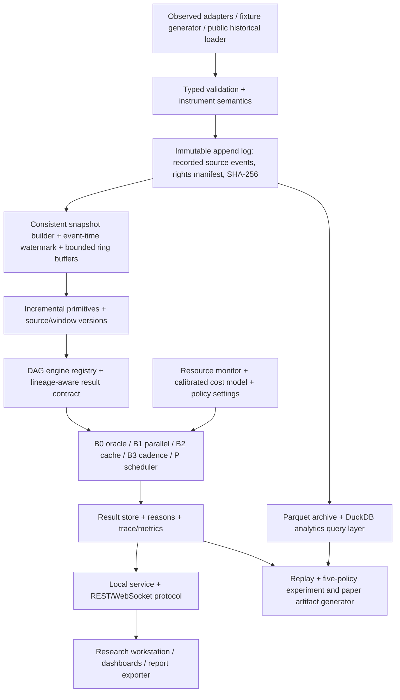

# MetalArch — 100× Capability Expansion Master Plan

**Planning baseline:** 2 October 2026 · `parthdongre/MetalArch`, branch `impl/native-reference`, inspected at commit `b80abd1268d3aa125958a0aa5eb6b9ed135d42e8`.

**Project identity:** **MetalArch: Resource-Efficient Execution for Multi-Engine Precious-Metal Analytics** — Phase II/III continuation of the original ASEP2 Metals Terminal. The original June 2026 paper and all previous source revisions remain intact.

**Status of this document:** proposed roadmap, NOT implemented features, a promise of 100-fold speed, established patent novelty, or publication acceptance. Features below are candidates and must be individually accepted, tested and measured. This plan supersedes the direction of the earlier legacy expansion plans, not their archived historical content.

## Executive decision

Build a resource-aware, offline-capable analytics workstation with an independently reproducible systems paper at its core. The term **100×** means a broad expansion of useful system capability across data types, engines, workflows, workspaces and experiments. It **does not** mean claiming 100× computational speed, 100× predictive quality, 100× literal indicator count, or a hard deadline for implementing every optional idea.

**Two release tracks:**

1. **Track R — publication-critical, frozen experiment:** resource-budgeted execution, verified data, measured budget enforcement, fair baselines, a manageable 19/32/64/128-engine scaling workload, and source-linked results. Finish this before changing the experimental algorithm or workload after results are collected.
2. **Track X — full-feature terminal:** broad analytics migration, high-fidelity market datasets, visual research workflows, ML, advanced quantitative modules, desktop packaging and carefully sandboxed extensibility. Implement incrementally without silently changing Track R baselines.

### Current verified basis (not a claim about final product)

- A C++20 single-session native core with dependency-derived graph execution, bounded windows, typed validity/provenance, version-aware caching, MA1 synthetic trace replay and five execution policies (B0, B1, B2, B3, preliminary P).
- `core` = 11 representative stages; `expanded` = 19 stages, the latter adding eight audited ASEP2-derived mathematical adaptations: ROC, Williams %R, CCI, Parkinson, Garman–Klass, Amihud, OBV/volume surge and CUSUM.
- Synthetic paired pilot and correctness tests exist; P is currently charged descriptor **nominal costs**, not enforced CPU/memory budgets. Its high deferral rate in the 19-stage 8-million-unit pilot is an unresolved problem. Parallel B1 was slower on small computational tasks.
- The more-developed **local ASEP2 archive** had 58 registered engine IDs at audit; the old paper's 71 is not the same verified count. The connected ASEP2 GitHub branch and local archive are different revisions. Only independently audited and appropriately attributed parts should be migrated.
- The original frontend, actual production market sources, historical paper and other ASEP2 functionality are **not** automatically present in MetalArch.

## 1. Invariants that govern every phase

**C1 Correctness:** B0 uncached correct reference always available. B1/B2 agree with B0 on matched valid input cuts within prespecified, method-specific tolerances. Intentionally deferred P/B3 outputs disclose age, status, reason and value disagreement.

**C2 Inputs and provenance:** explicit provider, venue, instrument type, currency, contract specification, timeframe, adjustments, market calendar/time zone, event/ingest time, source-mode (`OBSERVED`, `ESTIMATED`, `SIMULATED`) and data rights. A gold-linked token, spot XAU, GC futures and ETF shares must never be merged as semantically identical instruments.

**C3 Dependency and caching:** declared sources and upstream result versions; compile/check DAG at startup; no implicit neutral score on missing data; session-isolated state; key invalidation for changes to relevant history, book, peer, parameters, executable version and code/precision settings.

**C4 Scarcity is explicit:** bounds on CPU concurrency, peak memory, queue occupancy, disk budget, cache capacity, execution time, source freshness, energy when measurable and publish latency. On overload, reject, coalesce or defer under documented policy—never silently fabricate current validity.

**C5 Scientific traceability:** every benchmark stores code commit, lockfiles, hardware, compiler and optimization flags, seeds, raw input SHA-256, experiment configuration, output files and scripts; evidence ledger distinguishes proposed, implemented, tested, measured, independently reproduced and publication-ready.

**C6 IP, ethics and legacy:** preserve ASEP2 authorship, license history and cited work. Research claims refer to the actually evaluated revision. Review patent disclosure strategy BEFORE publishing any potentially new method; none is asserted as novel merely because it is implemented. Live execution of financial orders stays outside the publication-critical baseline.

## 2. Architecture: resource-constrained native core, thin integration boundary



**Runtime language decision:** retain modern **C++20** for ingestion-normalization seams requiring native throughput, consistent snapshots, common statistical primitives, compute kernels, executor, scheduler and benchmarking. Use measured SIMD/incremental/BLAS improvements rather than declaring any language universally fastest. Consider C++23 selectively where supported. Avoid a multi-language rewrite of the hot path. Use **Python only outside the critical loop** for experiment orchestration, plotting, reference oracles and optional offline ML training. Use **TypeScript + Canvas/WebGL** for UI; the serving layer can remain a thin proven C++ HTTP/WS service or FastAPI wrapper only after an overhead comparison. Optional Rust adapters only when a concrete safety or driver advantage outweighs an additional build/FFI layer.

**Data/storage decision:** contiguous in-RAM short-horizon buffers; event-log append and checksums; compressed Parquet archive and DuckDB for research queries; consider Arrow-compatible batches at exchange boundaries where they avoid measured copies. Arrow is column-oriented/zero-copy friendly for compatible layouts, not universally zero-copy; DuckDB can directly query Parquet with filtering and selected-column reads. Disk archive and telemetry must never block the live executor.

**Avoid by default:** mandatory Kafka, Kubernetes, blockchain, an LLM in the execution loop, GPU-only algorithms, broker-connected trading, multiple desktop wrappers and microservice sprawl. Introduce any of these only if an experiment demonstrates a need.

## 3. Feature expansion map — the complete candidate surface

Candidate families are a **planning inventory**; a feature only becomes “implemented” after registry+documented formula+independent oracle+edge tests+resource profile+provenance+benchmark. Do not count a parameter variation as a new independent research contribution.

### 3.1 Market-data coverage

- Adapters: normalized historical files, deterministic fixture, spot precious-metal feeds, commodity/metal futures, ETF bars/flows, crypto metal-linked instruments (explicitly distinct), macro series, calendar releases, news and permitted sentiment, positions/COT, rate curves and option chains.
- Granularity: ticks, trades, candles, book snapshots, bounded L2 delta reconstruction, corporate/contract/roll metadata, daily reference data, cross-asset peer observations and multi-timeframe materialized windows.
- Market semantics: provider/venue aliases, symbol registry, base/quote units, contract size, lot/tick sizes, exchange calendars, adjustment status, futures expiry/roll rule, backfill gap policy, delayed/live flags and provider licensing.
- Correctness: out-of-order/duplicate/correction handling, clock-skew measurement, snapshots with watermarks, schema migration, gap diagnostics, completeness score and feeds degrading to explicit unavailable states.

### 3.2 Native engine family candidate catalogue

| Family | Expansion candidates (not all implemented) | Source prerequisite / verification |
|---|---|---|
| Trend / price structure | EMA/SMA/WMA/HMA, MACD, ADX, Supertrend, Ichimoku, VWAP, anchored VWAP, Donchian, Keltner, pivots, fractal swings, market structure, multi-timeframe alignment | Reliable OHLCV and session semantics; independent formula tests |
| Oscillators | RSI variants, ROC, Williams %R, CCI, stochastic, stochastic RSI, TSI, CMO, MFI, Ultimate Oscillator, divergence, oscillator ensembles | Window/warm-up policy, unit correctness, missing-data tests |
| Volatility / dispersion | close-close, Parkinson, Garman–Klass, Rogers–Satchell, Yang–Zhang, ATR, realized/bipower variance, vol-of-vol, EWMA, GARCH family, variance-ratio, rolling quantiles | Proper bar frequency and intrabar quality; optimizer convergence cases |
| Volume / participation | OBV, VPT, volume surge, CMF, MFI, accumulation/distribution, VWAP bands, activity anomaly, trade imbalance, CVD, volume-at-price | Observed base vs quote volume; never fabricate fills |
| Microstructure / L2 | top-of-book imbalance, microprice, depth concentration, spread, order-flow imbalance, queue depletion, Lee–Ready only with suitable trade/quote alignment, VPIN, Kyle lambda, Hawkes on actual arrivals, impact/decay, liquidity heatmap, trade footprint | Real trade prints, ordered book deltas, bid/ask sizes and sequence continuity |
| Risk / tails | historical/parametric/filtered VaR, expected shortfall, EVT/POT, drawdown distribution, downside deviation, drawdown-at-risk, stress losses, conditional/cross-asset risk, liquidity-adjusted VaR | Clearly defined portfolio exposure and horizon; properly aligned strategy returns |
| Regime / changepoints | CUSUM, Page-Hinkley, BOCPD, Markov-switching/HMM, volatility states, trend/range, change probability, transition/dwell estimates, regime conditioning | Pre-registered thresholds and evaluation labels; avoid interpreting heuristic state as ground truth |
| Spectral / complexity | Goertzel, FFT/PSD, Lomb–Scargle where justified, CWT, coherence, Hilbert phase, EMD/SSA, Hurst/DFA, sample/permutation entropy, fractal dimension, recurrence | Sampling regularity, window edge effects and surrogate/null tests |
| Cross-asset / systemic | matched-time correlation, covariance, lead–lag, rolling beta, PCA, cointegration/ADF, spread/ratio z score, Granger tests, time-varying dependency graph, spillover indices, connectedness/network centrality | Actual independent assets, matched timestamps, stationarity assumptions |
| Macro / fundamentals | observed rates/yields, real-yield spread, macro-event windows, COT positioning, ETF flows, economic surprise, metal basis, currency cross effects, inventory/curve signals | Independent observed macro sources; no synthetic proxy represented as DXY/yield |
| Forecast / scenarios | deterministic baselines, AR/ARIMA where suitable, Kalman/state-space, GBM/Heston/jump scenario paths, bootstrap cones, stress shocks, risk forecasts, forecast calibration and conformal intervals | Train/test separation, seeds, coverage evaluation, no unsupported predictive claim |
| Derivatives | futures term structure, roll yield, basis, contango/backwardation, implied volatility, skew, option Greeks, volatility surfaces, put/call and Greeks-based exposure | Actual instrument chains, correct expiries, rates and contract multipliers |
| ML / uncertainty | rigorously defined feature store/forward target, leakage-safe LightGBM/XGBoost or native inference when justified, calibrated meta-model, online model drift, model registry, uncertainty decomposition | Walk-forward evaluation, no time leakage, licensed data and model versioning |
| Fusion / explainability | weighted fusion, dependency and missing-evidence coverage, source-quality weighting, sensitivity analyses, robust aggregation, per-engine contribution, counterfactual omission, uncertainty-aware score and reason trace | Never use an unavailable parent as a valid neutral vote |

The historical ASEP2 engine registry is the **migration backlog**, not the source of automatic truth. Maintain an engine migration matrix with legacy filename/ID, actual native ID, formula/reference, input requirements, numerical tolerance, source mode, status, version and benchmark cohort membership. A disabled old file is not a currently supported engine.

### 3.3 System/runtime capabilities

DAG visualization and cycle diagnostics; engine cost estimator; common-subexpression reuse; incremental window update; snapshot isolation; SIMD/CPU-feature dispatch; memory arenas; preallocated typed buffers; bounded MPMC/SPSC queues where justified; priority/backpressure; independent ingestion and serving pools; deadline-slack / critical path scheduling; source quality gates; per-node TTL; cache byte quotas and eviction; reason-coded skip; warm/cold start; graceful source failure and recovery; read-only replay; checkpoints; schema evolution; scheduling explainability; local health monitor; reproducible telemetry exports.

### 3.4 Research and benchmarking capabilities

B0/B1/B2/B3/P plus alternate policies (EDF, cache-only, least-cost-first, critical-path, round-robin, source-triggered incremental, optional small-instance optimal offline reference). Repeated identical trace playback; observed and synthetic data splits; controlled fault/burst fixtures; matched input-cut comparisons; miss and age histograms; per-engine/critical-path CPU and memory; energy where instrumentation permits; scheduler overhead and regret; confidence intervals; ablation switches; generated paper tables/figures; method-to-paper claims ledger; DOI/archive-ready artifact scripts; machine-readable experiment manifests.

### 3.5 Research workstation/UI capabilities

One coherent desktop browser workstation with: command bar and keyboard shortcuts; dockable multi-monitor saved workspaces; synchronized charts; data/source status indicator; engine inventory; dependency graph; timeline and replay scrubber; full-result lineage drawer; budget/freshness controls; what-changed diff; scheduler cost waterfall; stale vs valid heatmap; live telemetry explorer and DuckDB SQL panel; alerts; terminal-like instrument search; candlestick overlays; volume/tape/DOM; liquidity heatmap/footprint (only from real appropriate data); risk and forecast panels; spectral/wavelet panels; regime and anomaly ribbons; cross-asset graph; scenarios; research notes and citations; screenshot/CSV/SVG/Parquet/PDF export; compact read-only phone view; accessibility/color-blind mode. Do not conflate stale cached display with current evaluation.

### 3.6 User-facing optional extensions

Read-only report-sharing, paper-only portfolio sandbox, strategy expression builder with look-ahead checks, watchlists, cost/reproducibility badges, local query API, verified plugin SDK, historical comparative workspaces, dataset catalog and provenance explorer, source/engine documentation browser, limited explanation-oriented assistant that cites actual result IDs (never creates market facts or fires live trades), project templates, portable local installers and telemetry troubleshooting.

## 4. Phased expansion with dependencies and exit gates

The phases below describe **order of dependency**, not promised dates. Small PRs, each with passing CI, golden fixtures, tests and docs. Several product/UI and data-adapter tasks can proceed in parallel after contract stabilization.

| Phase | Focus / deliverables | Depends on | Exit gate: what must be demonstrably true | Track |
|---|---|---|---|---|
| **M0** | Snapshot source/legacy inventory; freeze 19-stage B0/B1/B2/B3/P v0; licensing/IP and authorship ledger; record current hardware/trace hashes | Current native branch | Clean tagged baseline + repeatable CI + separate original paper archive | R |
| **M1** | Real resource instrumentation: measured per-node CPU time, wall time, allocations/high-water RSS, queue occupancy; per-policy overhead, cost-estimator calibration; distinguish logical replay time from profiling clock | M0 | Calibration on prior trace only; deterministic replay unchanged; measurements and profiler overhead reported | R |
| **M2** | Source adapter contract, normalized real instrument registry, immutable WAL/MA2 recording, source-time watermark, gap/duplicate/late event policy; two legally usable independent trace sources or reproducible acquisition scripts | M0 | Trace re-ingests deterministically; raw and normalized checksums; explicit instrument/data rights; no provider-proxy confusion | R/X |
| **M3** | Incremental common OHLCV primitive graph, rolling update versions, source/engine cache byte quotas, window invalidation and event-driven recompute | M1,M2 | Differential B0 comparison for every update/correction/window expiry; no incorrect cache hits across symbols/sessions | R |
| **M4** | Scheduler P2: hard task/memory admission, source quality/TTL, measured cost estimates, critical-path/dependency closure, EDF or alternative policies, overload accounting, memory-pressure degradation | M1,M3 | No unflagged stale outputs; explicit defer/error reasons; actual constrained runs under declared quotas; bounded queues | R |
| **M5** | Publication evaluation: 19/32/64/128-stage controlled cohorts including heavier modules; identical traces; 5 baseline policies; CPU/memory and event-rate sweeps; recovery/fault tests; falsifiable ablation + negative results | M2–M4 | Raw per-event files, exact manifests/commands, repeated measurements and uncertainty, B0 correctness, source rights, no unsupported benefit claim | R |
| **M6** | Minimal research API and terminal re-bridge: stable C/C++ binding, REST/WS snapshot protocol, 6–8 critical views (graph, provenance, freshness, traces, costs, replay, comparison) | Stable M2/M3 result schema | CLI and UI show identical result IDs/status; no UI-blocking compute; integration tests | R/X |
| **M7** | ASEP2 native migration program: audited wave of simple, mid-cost and heavy mathematical families; 19 → candidate 40 → 64 → 96+ cohort inventory where justified | M3/M6 | Every port has independent numerical oracle, legacy adaptation note, data prerequisites, warm-up, B0/B2 consistency and resource profile | X |
| **M8** | High-fidelity microstructure and source depth: ticks, trade classification, book sequence/checkpoints, queue/imbalance, VPIN/Hawkes where actual data supports | M2,M7 | Real/recorded L2 replay consistency; zero invented trade allocation; source gaps flagged and propagated | X |
| **M9** | Macro, ETF, futures, options, positioning: observed source connectors and calendars; contract/curve semantics; permission-safe archive | M2 | Unit/source alignment tests, rights manifest, unavailable handling and reproducible corrected/roll-adjusted series | X |
| **M10** | Computational acceleration research: SIMD, incremental spectral/statistical kernels, BLAS/Eigen as indicated, preallocation, model/kernel batching, optional GPU A/B experiment | M3,M5 | Correctness within predeclared tolerances, cold/warm/energy/CPU/memory comparisons incl. dispatch overhead, portable fallback | X |
| **M11** | Stat/ML forecast and uncertainty lab: leakage-safe feature/target store; walk-forward; baseline vs advanced methods; calibration, drift and model provenance | M2,M7 | Proper future-target alignment; repeatable train/validation/test split; no contemporaneous-return strategy mistake | X |
| **M12** | Quant research suite: corrected walk-forward backtester, costs/slippage if data permits, stress tests, sensitivity, portfolio sandbox, scenario experiments and strategy DSL | M11/M9 | Strategy returns consistently derived from lagged decisions; not presented as actual attainable profits | X |
| **M13** | Full research workstation: workspace shell, multi-panel charts, market explorer, source-lineage drawer, replay timeline, scheduler controls, reporting, help and accessibility | M6,M7–M9 | Saved workspace, load testing, source/status visibility and keyboard-accessible core flows | X |
| **M14** | Reliability/security/operations: authentication only if multi-user, token isolation, secrets handling, role-scoped read access, retention, backups, fuzzing, chaos tests, health/telemetry dashboards | M2/M6 | No leaked credentials/redistributed licensed data; crash/restart replay, resource exhaustion and security smoke tests | X |
| **M15** | Plugin/SDK and packaging: versioned read-only engine plugin interface, signed/verified optional bundles, Windows/macOS/Linux builds, documentation/installer, optional PWA | Stable API M6, M14 | Plugin isolation tests and explicit permissions; reproducible builds on target OS and versioned migrations | X |
| **M16** | Optional frontier investigations: alternative constrained optimizer, memory-budget Pareto frontier, GPU accelerators, advanced topology/graph/causal methods and AI explanation | M5 and separate hypothesis/prior art review | Pre-registered improvement target, appropriate benchmark, IP/public-disclosure review before release | X |
| **M17** | Final integrated artifact: end-to-end regression, archive and release tag, manual/runbook, complete figures, manuscript revision and artifact reproducibility walkthrough | R paper M5 + selected X milestones | Independent clean environment reproduces the claims and demo; remaining nonimplemented features listed without fiction | R/X |

### Milestone release gates

**G0 / current:** native 19-stage prototype and synthetic result suite (already accomplished, not the full product).  
**G1 / research-correct:** M0–M3: real source recording, coherent cache and resource telemetry.  
**G2 / publishable study candidate:** M4–M5 plus minimal M6; no guaranteed acceptance.  
**G3 / usable research terminal:** selected M7–M9 and M13; reconnected source and research UI.  
**G4 / extended workstation:** M10–M15 with optional M16 evidence-gated.  
**G5 / artifact release:** M17, authorship and rights checked.

**Dependency discipline:** freeze and tag G2 workload/results before merging later new engines into paper claims. A wider terminal can keep evolving, but experimental results must point to the actual tag and tested engine set.

## 5. Hard-constrained evaluation design (publication-critical)

### Five test policies

- **B0** strict sequential full recomputation (correctness oracle).
- **B1** dependency-correct parallel full recomputation, with persistent worker pool and measured granularity overhead.
- **B2** source/version-correct cache-only execution; cache size/eviction must be documented.
- **B3** corrected fixed cadence that truthfully labels deferred results stale.
- **P** candidate resource/freshness/dependency-aware scheduler, compared against simple EDF/critical-path/least-cost policies when those are implemented. No claim of novelty or advantage before comparison.

### Proposed resource profiles — experimental knobs, not currently enforced facts

| Profile | Physical or enforced environment | Why it matters |
|---|---|---|
| L0 constrained | Linux cgroup quota equivalent to ~2 logical CPU cores; 512 MiB runtime limit; small bounded cache; single-client control | Quantifies graceful degradation on scarce resources |
| L1 midrange | ~4 logical cores; 2 GiB memory cap; moderate archive/queue budget | Separates scheduling benefit from cold-cache overhead |
| L2 wider | ~8 logical cores; 8 GiB limit or documented host availability | Tests when parallelization overcomes scheduling overhead |
| MacBook Air ARM reference | Native ARM64 experiment with OS/device configuration, thermals and power state reported | Portability/realistic local deployment; do **not** call a software throttle a hard OS-enforced quota |

All caps must be **measured and verified at runtime**. Use a Linux-controlled primary study for cgroup CPU/memory evidence, and macOS as supplementary cross-platform evidence. Physical core-count and heterogeneous ARM cores need explicit reporting; no assumption of equivalent performance across machines.

### Proposed workload factors

- Engine graphs: frozen 19 core, and ~32/64/128-stage **validated configurations** with documented cheap/medium/heavy method mix; no artificial multiplication of the same algorithm reported as novelty.
- Sources: identical replay fixtures plus at least two independent legally shareable observed traces or exact acquisition recipes, with independent gold/silver semantics.
- Update rate: pre-register a small grid such as 1, 10, 50 and 100 source events/s with bursts to 250/s **for synthetic stress only**; do not describe these as observed metal market rates.
- Instruments: 2, 8 and 32 validated simulated streams, then feasible real observed equivalents.
- CPU budget, memory cap, cache budget, TTL and freshness deadline: controlled factorial or selected paired contrasts, not an intractable all-combinations explosion.
- Repetitions: pre-register e.g. 10 or more measured runs per headline configuration with warm-up excluded, randomized/alternating policy order, stable data and within-host comparison.

### Report this entire metric tuple

`(event_to_publish_p50/p95/p99, CPU_seconds, RSS_peak, bytes_allocated, disk_IO, queue_p95/max, drops/coalesces, deadline_miss_fraction, source_age, result_age, valid_coverage, status/numerical_difference_to_B0, decision_disagreement, cache_hit/miss/incorrect_reuse, overhead_of_scheduler, recovery_time, replay_output_agreement)`.

Network/provider transit delay is **separate** from local event-to-output latency. A policy may reduce CPU by leaving outputs stale; show valid coverage and fidelity on the SAME plots as cost. Include run-level variability, confidence intervals when justified, plus negative/zero results. Hardware/cooldown and random seeds must be reproducible. Microbenchmark kernels separately from end-to-end scheduling and UI performance.

**Research success is NOT a predetermined speedup.** An outcome such as “caching helps while freshness scheduling adds overhead on cheap workloads” is legitimate if supported by controlled measurements. Evaluate the scheduler against a stronger B2 baseline and an offline small-DAG optimum where tractable; quantify any additional value rather than assuming it.

## 6. Concrete proposed scheduler investigation

The currently implemented P uses nominal descriptor cost and suffers excessive deferrals on the expanded workload at the same budget. Prioritize a **measured budget controller** over adding heuristic priority terms merely to make the algorithm look complicated.

Proposed progression:

1. Collect engine execution-time and allocation observations on a calibration partition only, with platform+input-shape+workload cohort in estimator identity. Estimate median and upper-quantile costs, cold/warm distinction and uncertainty.
2. For every source input cut, identify the invalidated DAG closure and critical path; treat VALID cached nodes as zero recompute cost only when their inputs and TTL are compatible.
3. Enforce measured CPU/memory reservation; admission decisions consider downstream unlocking, deadline slack, result-quality policy, and incremental-resource cost. Log exact priority, reservation and defer reason. Define deterministic tie-breaking.
4. Create a fallback when estimates are wrong (deadline missed, measured memory limit nearing breach or queue growth); never silently present previous outputs as current. Distinguish throughput-oriented and minimum-age experimental objectives.
5. Compare P against B2, fixed cadence, EDF/least-cost/critical-path and (on small DAGs) a fixed-trace offline reference. Report scheduler computation overhead, error from estimated vs actual cost, and Pareto frontier of CPU vs current-valid coverage/age/fidelity.

Potential research question (NOT an established contribution): **Under hard CPU and memory limits, can dependency-aware, measured-cost selective recomputation improve the freshness/fidelity frontier beyond correct caching and simpler scheduling policies on a representative, heterogeneous precious-metal pipeline?**

## 7. Engine migration contract — mandatory per stage

A new engine PR must include:

1. `Descriptor`: ID, semantic version, formula source/attribution, parameter schema, unit, required observed/optional inputs and parents, window, min samples, source age/result age, deterministic seed if used, expected cost and memory envelope.
2. Mathematically raw output values first. Do not relabel a raw statistic as a trading score. If a score is wanted, create and validate a separately versioned transformation with evidence-coverage rules.
3. Independent reference calculation (hand-calculated cases, verified library or derivation), constant/increasing/decreasing series, gaps, timestamps and zero-denominator tests, cross-platform floating tolerances, and no broad catch around assertions.
4. B0/B1/B2 differential tests and mutation matrix (primary, peer, book, source correction, params, time expiry); source/provenance/status downstream propagation.
5. Performance fixture: cold/warm p50/p95, allocations, incremental vs full output agreement; record meaningful CPU/worker overhead before SIMD/GPU specialization.
6. Visual/paper contract: explanation, input/source disclosure, status, timestamp and units; no invented empirical macro or order-flow data.

A migration board tracks **retired**, **catalogued**, **ported**, **oracle-validated**, **integration-tested**, **benchmark-qualified**, and **publication-workload** distinctly. Existing 19 engines do not inherit a blanket “published” flag.

## 8. Product UX: workstation modules and role-based view density

**Research workspace:** graph+raw numbers+source-lineage inspector, parameter variants, replay, side-by-side policy run, source completeness and run manifest.

**Market workspace:** synchronized candle/tape/volume, spread/DOM, selected risk, true source-specific market ticker, multi-timeframe comparison and drilldowns. No synthetic L2 masquerading as exchange depth.

**Quant workspace:** per-engine metric cards, kernel timings, spectral/wavelet charts, factor/cointegration diagnostics, uncertainty and experiment manager.

**Risk workspace:** exposure/scenario tables, VaR/ES/volatility where inputs permit, data gaps, stress and confidence caveats.

**Systems workspace:** live DAG, budget meter, CPU/RSS/queue/TTL telemetry, cache/invalidation reasons, critical-path waterfall, stale heatmap, per-policy comparison.

**Replay workspace:** trace selector and rights manifest, virtual-time scrubber, snapshot diff, full status/provenance lineage, export the exact selected historical input cut and result.

**Academic/author workspace:** citations tied to mathematical methods, originality/attribution ledger, figure builder, raw result IDs and one-command replication. Separate before/after claims by experimental cohort.

The terminal can be visually ambitious, but every shown number must state **what it is, when it is from, how it was computed, which source supplied it and whether it remains valid**.

## 9. Repo structure to grow toward (not yet implemented)

```text
MetalArch/
  CMakeLists.txt
  cmake/                          # profiles, sanitizers, reproducible flags
  include/metalarch/
    contracts/                    # events, instruments, source metadata, result validity
    data/                         # bounded store, watermark, snapshots, source versions
    scheduler/                    # B0/B1/B2/B3/P plus research policies
    engines/                      # descriptors, families, independent native kernels
    telemetry/                    # clocks, CPU, memory, statistics, trace IDs
    replay/                       # read/write/version migration, input log
    service/                      # versioned native API and gateway
  src/{contracts,data,scheduler,engines,replay,service,telemetry}/
  adapters/{historical,recorded,observed,simulated}/
  web/{app,components,workspaces,styles}/
  research/{benchmarks,fixtures,oracles,ablations,notebooks,figures}/
  tests/{unit,property,differential,source,security,stress,golden}/
  docs/{architecture,engineering,source_rights,ROADMAP_100X.md}/
  paper/{legacy,archive,figures,results,METALARCH_DRAFT.md}/
  artifacts/                      # gitignored raw local runs; curated rights-safe subset tagged
  .github/workflows/
```

Transition incrementally with small moves and compatibility tests; do NOT bulk-delete the existing layout. Keep CI build matrix for macOS ARM where available, Linux GCC/Clang, sanitizers and an independent benchmarking workflow. For performance CI, use trends/tolerances and dedicated runner context; do not set flaky absolute nanosecond gates on shared runners.

## 10. Prioritization and change-control board

| Lane | Must do now | Later/optional | Rule |
|---|---|---|---|
| Publishable study | measured budgets, observed/reproducible input capture, oracle, P calibration, controlled five-policy experiments, sourced paper | extensive frontend, hundreds of engines, predictive trading | freeze cohort before manuscript results |
| Engine breadth | audit 8–15 higher-cost/heterogeneous methods for next 32-stage cohort | add all legacy/unusual methods | no registrations without tests/data semantics |
| Frontend | reconnect the previous ASEP2 UI to stable result API, add provenance/systems panels | intricate decorative motion/mobile/voice | correctness visible before cosmetic polish |
| Data | independently verified source names, rights and immutable traces | all markets, premium providers, scraping | no scraped or redistributed proprietary feeds without permission |
| Performance | instrument, incremental updates, cache, bounded queues | GPU, distributed architecture, custom allocator everywhere | optimize bottlenecks proven by profiles |
| ML | leak-free features and target correction, simple baseline | LLMs, graph/RL models, agent trading | advanced model only after correct validation |
| IP | prior-art mapping, author/inventor review, disclosure timeline | provisional filing or defensive publication based on counsel | roadmap contains no novelty guarantee |

**Feature acceptance levels:** `proposed` → `implemented` → `numerically-validated` → `integrated` → `resource-profiled` → `experimental-artifact` → `publication-eligible`. Prevent broad README/marketing numbers from silently treating candidates as completed.

## 11. Risk register and stop conditions

| Risk | Consequence | Control / stop condition |
|---|---|---|
| 100× breadth before stable core | unstable result contracts and paper never finishes | do not begin full M7 migration before G2 design locked |
| Incorrect source semantics or rights | invalid macro/microstructure claims, irreproducible paper | quarantine source until manifest and legal-use review pass |
| Paper self-plagiarism/author mismatch | publication or grading issue | cite/disclose ASEP2, preserve coauthors, maintain contribution crosswalk |
| Patent concept disclosed prematurely | possible loss of options in some jurisdictions | private prior-art/invention review before public algorithm details |
| Synthetic latency treated as live | misleading research | manifest source mode, label derived vs measured, separate provider/network delay |
| Hardcoded nominal P budget | overdeferrals and unfair policy comparison | M1 measured estimator and cgroup-enforced profile gate |
| Massive feature count masks weak data | invalid indicators and memory blow-up | source prerequisites + 19/32/64/128 cohort acceptance |
| GPU/distribution overshadows local aim | maintenance and resource regression | require within-host baseline, measured workload need and portability |
| ML look-ahead / bad strategy returns | spurious claimed predictive performance | corrected future labels, strict time splits and B0 numerical oracles |
| Frontend stale data appears current | false source confidence | status/age on every result, schema contract tests and accessibility review |

## 12. First ten executable issue-sized tasks

1. Pin an immutable release tag on `b80abd1` and preserve the present paired trace + results as `G0` with one-command reproduction.
2. Add `ResourceSample` / per-node instrumentation, measured CPU-thread time, allocation counters where possible and calibration manifest; explicitly separate `declared_cost_ns` from `measured_cost_ns`.
3. Build MA2 recorded-source schema including event ID, sequence, ingest/event timestamps, corrections, provider license/source metadata and incremental append checksum.
4. Implement read-only adapter for **one rights-safe observed** OHLCV source plus a second independent peer; validate instrument unit/timeframe identity and gaps.
5. Implement typed rolling primitive DAG (returns, typical price, true range, sums, means, quantiles where needed) with B0 golden numerical equivalence; introduce a bounded byte-budget cache.
6. Build source-triggered invalidation, gap and backlog diagnostics, recovery checkpoint and session-isolation stress tests.
7. Write benchmark resource profile launcher with verified Linux cgroup quotas and deterministic synthetic event-rate generator; record measured enforcement failures instead of continuing silently.
8. Replace nominal P cost with calibrated, frozen run-specific estimates; add EDF and critical-path simple comparator and safe fallback.
9. Construct the 32-stage experimental graph with genuinely varied costs (e.g. native spectral/wavelet/statistics) and separately documented synthetic cost injectors; pre-register ablations.
10. Restore a minimal ASEP2-like terminal using the new result API: DAG, source status, freshness, compute waterfall, paired replay. Then freeze the experiment protocol and run the publication study.

## 13. Publication and deliverable checklist

The paper should still be titled **“MetalArch: Resource-Efficient Execution for Multi-Engine Precious-Metal Analytics”** unless a selected venue demands another format. It is a sourced continuation of ASEP2, not a wholly independent rediscovery. Include research problem; previous contribution; exact limitations found on the old revision; new architecture; observed/recorded workload; experiment protocol; baselines; measured CPU-memory-freshness-fidelity frontier; ablations; mixed/negative results; validity threats; artifact availability. Preserve original authorship and verify authors' current contributions/affiliations prior to submission. Patentability, venue indexing and acceptance must never be promised.

**Definition of 100×-plan completion:** A public, source-linked inventory of delivered versus planned capabilities; at least G2's reproducible research release; then selected G3–G4 features demonstrated in an integrated terminal, with no invented metrics, false input semantics or unqualified feature-count claims. The optional backlog can remain open without invalidating the core paper.

---

### Legacy-source lineage and technical-selection notes

Planning inputs: connected MetalArch branch `b80abd1`; `docs/IMPLEMENTATION_PHASE3.md`, `docs/BLUEPRINT.md`, `docs/ENGINE_AUDIT.md`, `paper/CONTINUATION_MAP.md`; prior ASEP2 `RESEARCH_GRADE_PLAN.md`, `PLAN_100X.md`, `PLAN_1000X.md`, `MASTER_IMPLEMENTATION_PLAN.md`, `PLAN_TECHSTACK.md`, `REMAKE_PLAN.md`, `OVERHAUL_PLAN.md`. Older planning documents are feature ideas, not proof that those capabilities are implemented. Infrastructure references: Apache Arrow columnar format (Arrow docs), DuckDB Parquet query guide (DuckDB docs), OpenTelemetry C++ (official docs), Google Benchmark (official repository). All specific stacks are design choices subject to license/version and performance verification during their phases.
